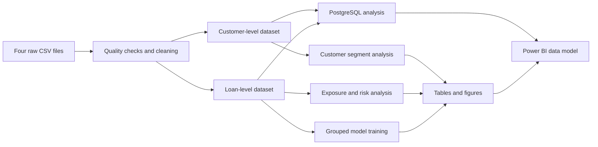

# Banking Customer Risk Intelligence

An end-to-end analytics project using Python, PostgreSQL, Power BI and machine learning to study customer value, lending exposure and active-loan default risk.

## Business Problem

A bank needs to understand two connected areas:

1. **Customer portfolio value**: which customer segments hold deposits and support relationship value?
2. **Lending risk**: where is loan exposure concentrated, which products show higher default rates, and which active loans should be reviewed first?

The analysis answers:

- Which customer and relationship segments hold the strongest deposit balances?
- Which loan products create the largest exposure and expected loss?
- How do DTI, credit score, LTV and delinquency relate to default?
- Which active loans receive the highest predicted default probability?

This is a portfolio-analysis and monitoring project. It does **not** automate loan approval or prove that a customer will default.

## Dataset

### Portfolio size

| Item | Value |
|---|---:|
| Customer profiles | 15,000 |
| Loan records | 11,911 |
| Customers with at least one loan | 10,279 |
| Customers without a loan | 4,721 |
| Default loans | 1,478 |
| Non-default loans | 10,433 |
| Loan-level default rate | 12.41% |
| Customer-level default rate among borrowers | 13.97% |
| Total loan exposure | INR 2,460.72 crore |
| Estimated expected loss | INR 199.17 crore |

### Raw files

| File | Rows | Purpose |
|---|---:|---|
| `data/raw/customers.csv` | 15,000 | Customer identity, demographics, occupation and bank relationship. |
| `data/raw/financial_profile.csv` | 15,000 | Income, deposits, card balances, debt payments and financial position. |
| `data/raw/loans.csv` | 11,911 | Loan type, amount, term, rate, collateral and purpose. |
| `data/raw/loan_risk.csv` | 11,911 | Credit score, DTI, LTV, missed payments, days past due, repayment status and default target. |

### Processed files

| File | Grain | Main use |
|---|---|---|
| `data/processed/banking_customer_profiles_clean.csv` | One row per customer | Customer and segment analysis. |
| `data/processed/banking_customer_loan_analytics_clean.csv` | One row per loan | Exposure, repayment-risk and modelling analysis. |
## Data Quality

The raw files intentionally contain missing values, inconsistent category labels and financial outliers so the preparation stage reflects realistic cleaning work.

Verified results after cleaning:

| Check | Result |
|---|---:|
| Duplicate customer IDs | 0 |
| Duplicate loan IDs | 0 |
| Exact duplicate customer rows | 0 |
| Exact duplicate loan rows | 0 |
| Invalid age, income, loan, credit-score or target ranges | 0 |
| Unmatched customer-financial records | 0 |
| Unmatched loan-risk records | 0 |
| Remaining missing LTV values | 3,324 |

The remaining LTV values are logically missing for unsecured loans. Financial outliers are retained because large deposits, high incomes, large loans and high expected-loss accounts are relevant to portfolio analysis.

## Key Business Findings

| Finding | Evidence | Business interpretation |
|---|---|---|
| Home Loans dominate exposure | 4,565 loans; INR 1,710.92 crore exposure; INR 106.05 crore expected loss | Home Loans are not the highest-default product, but their size makes them the largest portfolio-loss concentration. |
| Business Loans have the highest product default rate | 1,929 loans; 30.79% default rate; INR 84.94 crore expected loss | Business lending requires closer underwriting and active monitoring. |
| High-risk loans are the main review group | 2,144 loans with a 53.82% default rate | Review resources should focus first on the High risk band. |
| DTI above 60% shows greater repayment pressure | 5,303 loans with a 21.78% default rate | Income alone is not enough; existing debt commitments materially affect repayment capacity. |
| Recent delinquency is a strong monitoring signal | 6,340 recently delinquent loans with a 23.31% default rate | Missed payments and days past due are useful for active-loan early warnings, not initial approval. |
| Commercial relationships have the highest segment default rate | 1,614 loans with a 22.80% default rate | Commercial exposure should be reviewed by product, collateral and debt pressure. |
| Private Bank and Platinum customers hold stronger deposits | Median deposits: INR 2.96M for Private Bank and INR 4.90M for Platinum customers | These groups are important for deposit stability and relationship management. |

## Recommended Actions

| Area | Action supported by the analysis |
|---|---|
| Exposure management | Monitor large Home Loans separately because moderate default rates still create large expected loss. |
| Product risk | Apply closer review to Business Loans, especially when DTI, credit score or collateral strength is weak. |
| Early warning | Prioritize active loans with missed payments, days past due, High risk classification or DTI above 60%. |
| Customer management | Protect high-deposit Private Bank and Platinum relationships while monitoring any risky borrowing attached to them. |
| Model use | Use predicted probability to rank loans for manual review; do not use it as an automatic approval decision. |
| Dashboard use | Read exposure, default rate and expected loss together rather than relying on loan counts alone. |

## Project Workflow



## Repository Structure

```text
Banking-Customer-Risk-Intelligence/
|-- data/
|   |-- raw/
|   |   |-- customers.csv
|   |   |-- financial_profile.csv
|   |   |-- loans.csv
|   |   `-- loan_risk.csv
|   `-- processed/
|       |-- banking_customer_profiles_clean.csv
|       `-- banking_customer_loan_analytics_clean.csv
|-- notebooks/
|   |-- 01_data_quality_and_preparation.ipynb
|   |-- 02_customer_and_segment_eda.ipynb
|   |-- 03_financial_exposure_and_risk_eda.ipynb
|   `-- 04_default_prediction_model.ipynb
|-- reports/
|   |-- README.md
|   |-- figures/
|   `-- tables/
|-- sql/
|   |-- 01_schema_and_validation.sql
|   |-- 02_customer_segment_analysis.sql
|   `-- 03_financial_and_risk_analysis.sql
|-- dashboard/
|   |-- banking analysis_completed.pbix
|   |-- pbip/
|   `-- screenshots/
|-- requirements.txt
`-- README.md
```

## Analysis Stages

### 1. Data preparation

`notebooks/01_data_quality_and_preparation.ipynb`

- Audits row counts, keys, missing values, category labels and valid ranges.
- Repairs recoverable missing values and preserves logical missing LTV values.
- Validates customer-to-financial and loan-to-risk joins.
- Builds customer-level and loan-level datasets.
- Creates reusable bands and indicators for age, income, credit utilization, DTI, LTV, credit score and delinquency.
- Uses IQR summaries and boxplots to inspect rather than automatically delete financial outliers.

Primary outputs:

- `reports/tables/data_quality_summary.csv`
- `reports/tables/duplicate_summary.csv`
- `reports/tables/missing_value_summary.csv`
- `reports/tables/data_dictionary.csv`
- `reports/figures/data_quality/outlier_boxplots.png`

### 2. Customer and segment analysis

`notebooks/02_customer_and_segment_eda.ipynb`

The customer analysis covers demographics, employment, relationship type, loyalty, income, deposits, credit utilization and advisor portfolios.

Selected results:

| Metric | Result |
|---|---:|
| Median age | 47 years |
| Median annual income | INR 874,387 |
| Median deposits | INR 2,344,104 |
| Average bank tenure | 14.30 years |
| Largest age group | 46-55 years, 4,351 customers |
| Largest relationship segment | Retail, 7,821 customers |
| Most common credit-utilization band | Low, 10,257 customers |

Primary outputs:

- `reports/tables/customer_kpis.csv`
- `reports/tables/customer_segment_insights.csv`
- `reports/tables/banking_relationship_summary.csv`
- `reports/tables/loyalty_summary.csv`
- `reports/figures/customer_segments/`

### 3. Financial exposure and risk analysis

`notebooks/03_financial_exposure_and_risk_eda.ipynb`

The lending analysis compares exposure, repayment status, default rate and expected loss by loan type, customer relationship, risk band, DTI, credit score, LTV and delinquency status. It uses distribution plots, boxplots, scatter plots, donut charts, grouped bars and correlation heatmaps.

Primary outputs:

- `reports/tables/portfolio_kpis_readable.csv`
- `reports/tables/loan_type_summary.csv`
- `reports/tables/risk_band_summary.csv`
- `reports/tables/default_by_dti_band.csv`
- `reports/tables/risk_field_correlation_matrix.csv`
- `reports/figures/financial_exposure/`

The verified portfolio findings from this notebook are summarized once in [Key Business Findings](#key-business-findings).

### 4. Default-risk modelling

`notebooks/04_default_prediction_model.ipynb`

The target is `default_flag`:

| Value | Meaning |
|---:|---|
| `0` | The loan is not marked as defaulted. |
| `1` | The loan is marked as defaulted or written off in the prepared dataset. |

#### Leakage control and split

The notebook separates two use cases:

- **Approval-style features** exclude active repayment-warning fields.
- **Monitoring features** add missed payments, days past due and risk band for active-loan review.

`StratifiedGroupKFold` keeps every `customer_id` entirely in training or testing.

| Split check | Result |
|---|---:|
| Training loan rows | 8,937 |
| Test loan rows | 2,974 |
| Training customers | 7,709 |
| Test customers | 2,570 |
| Customer overlap | 0 |
| Training default rate | 12.34% |
| Test default rate | 12.61% |

#### Model comparison

Logistic Regression is retained as an interpretable baseline. Random Forest is tuned with `RandomizedSearchCV` using grouped cross-validation on training customers only.

| Feature set | Model | Precision | Recall | F1 | ROC-AUC | False negatives | False positives |
|---|---|---:|---:|---:|---:|---:|---:|
| Approval-style | Logistic Regression | 0.2860 | 0.6933 | 0.4050 | 0.7949 | 115 | 649 |
| Approval-style | Random Forest | 0.3086 | 0.6533 | 0.4192 | 0.7983 | 130 | 549 |
| Monitoring | Logistic Regression | 0.8252 | 0.9440 | 0.8806 | 0.9950 | 21 | 75 |
| Monitoring | Random Forest | 0.7188 | **0.9680** | 0.8250 | 0.9861 | **12** | 142 |

The selected model is the **Monitoring Random Forest** because this project prioritizes catching default-risk loans. On the test set it catches **363 of 375 defaults** and misses **12**. This choice accepts more false alerts than Monitoring Logistic Regression in exchange for fewer missed defaults.

Top Random Forest drivers:

| Feature | Importance |
|---|---:|
| `days_past_due` | 38.99% |
| `risk_band` | 23.20% |
| `missed_payments_12m` | 16.78% |
| `debt_to_income_ratio` | 3.90% |
| `credit_score` | 3.34% |

Because the strongest drivers include repayment behaviour, the selected model is an **active-loan monitoring model**, not a before-approval credit model.

Primary outputs:

- `reports/tables/model_performance_metrics.csv`
- `reports/tables/random_forest_tuning_summary.csv`
- `reports/tables/random_forest_feature_importance.csv`
- `reports/tables/high_risk_loan_predictions.csv`
- `reports/figures/modeling/`

## PostgreSQL Analysis

The SQL layer validates the imported clean datasets and reproduces the main customer, exposure and risk summaries.

| SQL file | Purpose |
|---|---|
| `sql/01_schema_and_validation.sql` | Checks table structure, rows, duplicates, missing values, ranges and customer-loan joins. |
| `sql/02_customer_segment_analysis.sql` | Analyzes age, gender, relationship, loyalty, income and advisor segments. |
| `sql/03_financial_and_risk_analysis.sql` | Analyzes exposure, repayment, DTI, LTV, default rates and expected loss. |

Expected PostgreSQL tables:

- `public.banking_customer_profiles_clean`
- `public.banking_customer_loan_analytics_clean`

Example execution:

```bash
psql -d banking_project -f sql/01_schema_and_validation.sql
psql -d banking_project -f sql/02_customer_segment_analysis.sql
psql -d banking_project -f sql/03_financial_and_risk_analysis.sql
```

## Reports

`reports/` contains **52 CSV summary tables** and **35 PNG figures** generated by the notebooks. Start with `reports/README.md` for a guided list of the most useful outputs.

## Power BI Dashboard

The Power BI dashboard is included under `dashboard/` as PBIX and PBIP files. It presents customer, loan and deposit analysis across four interactive report pages.

<details>
<summary>Open dashboard screenshots</summary>

### Home


### Loan Analysis


### Deposit Analysis


### Summary


</details>

## Setup

Create an environment and install dependencies:

```bash
python -m venv .venv
python -m pip install -r requirements.txt
```

Run the notebooks in order:

```text
01_data_quality_and_preparation.ipynb
02_customer_and_segment_eda.ipynb
03_financial_exposure_and_risk_eda.ipynb
04_default_prediction_model.ipynb
```

Suggested reading order:

1. Root `README.md`
2. Notebooks from `01` to `04`
3. `reports/README.md`
4. SQL files from `01` to `03`
5. Power BI files under `dashboard/`
