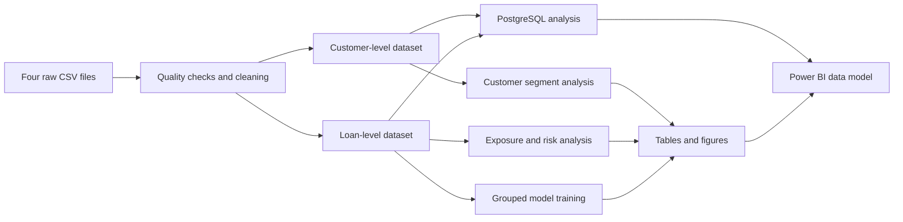

# Banking Customer Risk Intelligence

An end-to-end analytics project using Python, PostgreSQL, Power BI and machine learning to study customer value, lending exposure and active-loan default risk.

## Business Problem

Before approving a loan, a bank must determine whether a customer has the financial capacity to repay it and whether the proposed lending creates an acceptable level of risk. Income alone is not enough for this decision. The bank also needs to consider existing debt obligations, deposit strength, credit score, debt-to-income ratio (DTI), collateral coverage, loan-to-value ratio (LTV), customer relationship and the performance of similar loans in its portfolio.

These signals are often stored across separate customer, account and lending records. When they are reviewed independently, the bank may approve unaffordable credit, overlook financially strong customers, build excessive exposure in risky products or segments, and identify repayment problems too late.

This project combines customer profiles, service segments, financial balances, loan details and repayment-risk indicators to support two connected decisions:

1. **Pre-lending assessment:** evaluate customer affordability, leverage, collateral coverage and financial relationship before extending additional credit.
2. **Post-lending monitoring:** measure portfolio exposure, default rates and expected loss, then identify active loans that require earlier review.

The analysis shows where deposits and customer value are concentrated, which lending products and customer segments carry the greatest risk, and how DTI, credit score, LTV, missed payments and delinquency relate to default. A tuned Random Forest model then assigns default probabilities to active loans so risk teams can prioritize investigation and intervention.

The result is a decision-support workflow that helps the bank lend more responsibly, monitor its portfolio consistently and direct attention toward the customers and loans that need it most.

## Dataset

### Portfolio size

| Item | Value |
|---|---:|
| Customer profiles | 15,000 |
| Loan records | 11,911 |
| Customers with at least one loan | 10,279 |
| Customers without a loan | 4,721 |
| Default loans | 1,478 |
| Non-default loans | 10,433 |
| Loan-level default rate | 12.41% |
| Customer-level default rate among borrowers | 13.97% |
| Total loan exposure | INR 2,460.72 crore |
| Estimated expected loss | INR 199.17 crore |

### Raw files

| File | Rows | Purpose |
|---|---:|---|
| `data/raw/customers.csv` | 15,000 | Customer identity, demographics, occupation and individual service segment. |
| `data/raw/financial_profile.csv` | 15,000 | Income, deposits, card balances, debt payments and financial position. |
| `data/raw/loans.csv` | 11,911 | Loan type, amount, term, rate, collateral and purpose. |
| `data/raw/loan_risk.csv` | 11,911 | Credit score, DTI, LTV, missed payments, days past due, repayment status and default target. |

### Processed files

| File | Grain | Main use |
|---|---|---|
| `data/processed/banking_customer_profiles_clean.csv` | One row per customer | Customer and segment analysis. |
| `data/processed/banking_customer_loan_analytics_clean.csv` | One row per loan | Exposure, repayment-risk and modelling analysis. |
### Portfolio scope

Every customer record represents an individual. `customer_segment` describes
the service tier through which the bank manages that person:

| Segment | Definition |
|---|---|
| Retail | Regular individual customers using standard deposits, cards and personal lending products. |
| Priority | Affluent individual customers receiving enhanced service, preferential benefits or a dedicated relationship manager. |
| Private Banking | High-value individual customers receiving personalized banking, wealth and relationship-management services. |

Priority and Private Banking are service tiers, not separate legal customer
types. `loyalty_classification` remains a separate measure of engagement.
Business Loans are business-related products held by individual borrowers;
corporate and institutional banking are outside this project's scope.

## Data Quality

The raw files intentionally contain missing values, inconsistent category labels and financial outliers so the preparation stage reflects realistic cleaning work.

Verified results after cleaning:

| Check | Result |
|---|---:|
| Duplicate customer IDs | 0 |
| Duplicate loan IDs | 0 |
| Exact duplicate customer rows | 0 |
| Exact duplicate loan rows | 0 |
| Invalid age, income, loan, credit-score or target ranges | 0 |
| Unmatched customer-financial records | 0 |
| Unmatched loan-risk records | 0 |
| Remaining missing LTV values | 3,324 |

The remaining LTV values are logically missing for unsecured loans. Financial outliers are retained because large deposits, high incomes, large loans and high expected-loss accounts are relevant to portfolio analysis.

## Key Business Findings

| Finding | Evidence | Business interpretation |
|---|---|---|
| Home Loans dominate exposure | 4,565 loans; INR 1,710.92 crore exposure; INR 106.05 crore expected loss | Home Loans are not the highest-default product, but their size makes them the largest portfolio-loss concentration. |
| Business Loans have the highest product default rate | 1,929 loans; 30.79% default rate; INR 84.94 crore expected loss | Business lending requires closer underwriting and active monitoring. |
| High-risk loans are the main review group | 2,144 loans with a 53.82% default rate | Review resources should focus first on the High risk band. |
| DTI above 60% shows greater repayment pressure | 5,303 loans with a 21.78% default rate | Income alone is not enough; existing debt commitments materially affect repayment capacity. |
| Recent delinquency is a strong monitoring signal | 6,340 recently delinquent loans with a 23.31% default rate | Missed payments and days past due are useful for active-loan early warnings, not initial approval. |
| Priority customers have the highest segment default rate | 2,908 loans; 17.33% default rate; INR 68.56 crore exposure; INR 72.82 crore expected loss | Priority loans need closer review, but segment alone should not determine a credit decision. |
| Private Banking customers hold the strongest median deposits | 3,496 customers; median deposits INR 2.96M; median income INR 1.11M | High-value service tiers are important for deposit stability and relationship management. |

## Recommended Actions

| Area | Action supported by the analysis |
|---|---|
| Exposure management | Monitor large Home Loans separately because moderate default rates still create large expected loss. |
| Product risk | Apply closer review to Business Loans, especially when DTI, credit score or collateral strength is weak. |
| Early warning | Prioritize active loans with missed payments, days past due, High risk classification or DTI above 60%. |
| Customer management | Protect high-deposit Private Banking and Platinum customers while monitoring any risky borrowing attached to them. |
| Model use | Use predicted probability to rank loans for manual review; do not use it as an automatic approval decision. |
| Dashboard use | Read exposure, default rate and expected loss together rather than relying on loan counts alone. |

## Project Workflow



## Repository Structure

```text
Banking-Customer-Risk-Intelligence/
|-- data/
|   |-- raw/
|   |   |-- customers.csv
|   |   |-- financial_profile.csv
|   |   |-- loans.csv
|   |   `-- loan_risk.csv
|   `-- processed/
|       |-- banking_customer_profiles_clean.csv
|       `-- banking_customer_loan_analytics_clean.csv
|-- notebooks/
|   |-- 01_data_quality_and_preparation.ipynb
|   |-- 02_customer_and_segment_eda.ipynb
|   |-- 03_financial_exposure_and_risk_eda.ipynb
|   `-- 04_default_prediction_model.ipynb
|-- reports/
|   |-- README.md
|   |-- figures/
|   `-- tables/
|-- sql/
|   |-- 01_schema_and_validation.sql
|   |-- 02_customer_segment_analysis.sql
|   `-- 03_financial_and_risk_analysis.sql
|-- dashboard/
|   |-- banking analysis_completed.pbix
|   |-- pbip/
|   `-- screenshots/
|-- requirements.txt
`-- README.md
```

## Analysis Stages

### 1. Data preparation

`notebooks/01_data_quality_and_preparation.ipynb`

- Audits row counts, keys, missing values, category labels and valid ranges.
- Repairs recoverable missing values and preserves logical missing LTV values.
- Validates customer-to-financial and loan-to-risk joins.
- Builds customer-level and loan-level datasets.
- Creates reusable bands and indicators for age, income, credit utilization, DTI, LTV, credit score and delinquency.
- Uses IQR summaries and boxplots to inspect rather than automatically delete financial outliers.

Primary outputs:

- `reports/tables/data_quality_summary.csv`
- `reports/tables/duplicate_summary.csv`
- `reports/tables/missing_value_summary.csv`
- `reports/tables/data_dictionary.csv`
- `reports/figures/data_quality/outlier_boxplots.png`

### 2. Customer and segment analysis

`notebooks/02_customer_and_segment_eda.ipynb`

The customer analysis covers demographics, employment, customer segment, loyalty, income, deposits, credit utilization and advisor portfolios.

Selected results:

| Metric | Result |
|---|---:|
| Median age | 47 years |
| Median annual income | INR 874,387 |
| Median deposits | INR 2,344,104 |
| Average bank tenure | 14.30 years |
| Largest age group | 46-55 years, 4,351 customers |
| Largest customer segment | Retail, 7,821 customers (52.14%) |
| Most common credit-utilization band | Low, 10,257 customers |

Primary outputs:

- `reports/tables/customer_kpis.csv`
- `reports/tables/customer_segment_insights.csv`
- `reports/tables/customer_segment_summary.csv`
- `reports/tables/segment_income_summary.csv`
- `reports/tables/segment_loyalty_matrix.csv`
- `reports/tables/advisor_segment_summary.csv`
- `reports/tables/loyalty_summary.csv`
- `reports/figures/customer_segments/`

### 3. Financial exposure and risk analysis

`notebooks/03_financial_exposure_and_risk_eda.ipynb`

The lending analysis compares exposure, repayment status, default rate and expected loss by loan type, customer segment, risk band, DTI, credit score, LTV and delinquency status. It uses distribution plots, boxplots, scatter plots, donut charts, grouped bars and correlation heatmaps.

Primary outputs:

- `reports/tables/portfolio_kpis_readable.csv`
- `reports/tables/loan_type_summary.csv`
- `reports/tables/risk_band_summary.csv`
- `reports/tables/default_by_dti_band.csv`
- `reports/tables/risk_field_correlation_matrix.csv`
- `reports/figures/financial_exposure/`

The verified portfolio findings from this notebook are summarized once in [Key Business Findings](#key-business-findings).

### 4. Default-risk modelling

`notebooks/04_default_prediction_model.ipynb`

The target is `default_flag`:

| Value | Meaning |
|---:|---|
| `0` | The loan is not marked as defaulted. |
| `1` | The loan is marked as defaulted or written off in the prepared dataset. |

#### Leakage control and split

The notebook separates two use cases:

- **Approval-style features** exclude active repayment-warning fields.
- **Monitoring features** add missed payments, days past due and risk band for active-loan review.

`StratifiedGroupKFold` keeps every `customer_id` entirely in training or testing.

| Split check | Result |
|---|---:|
| Training loan rows | 8,937 |
| Test loan rows | 2,974 |
| Training customers | 7,709 |
| Test customers | 2,570 |
| Customer overlap | 0 |
| Training default rate | 12.34% |
| Test default rate | 12.61% |

#### Model comparison

Logistic Regression is retained as an interpretable baseline. Random Forest is tuned with `RandomizedSearchCV` using grouped cross-validation on training customers only.

| Feature set | Model | Precision | Recall | F1 | ROC-AUC | False negatives | False positives |
|---|---|---:|---:|---:|---:|---:|---:|
| Approval-style | Logistic Regression | 0.2862 | 0.6907 | 0.4047 | 0.7958 | 116 | 646 |
| Approval-style | Random Forest | 0.3155 | 0.6587 | 0.4266 | 0.7975 | 128 | 536 |
| Monitoring | Logistic Regression | 0.8252 | 0.9440 | 0.8806 | 0.9951 | 21 | 75 |
| Monitoring | Random Forest | 0.7213 | **0.9733** | 0.8286 | 0.9865 | **10** | 141 |

The selected model is the **Monitoring Random Forest** because this project prioritizes catching default-risk loans. On the test set it catches **365 of 375 defaults** and misses **10**. This choice accepts more false alerts than Monitoring Logistic Regression in exchange for fewer missed defaults.

Top Random Forest drivers:

| Feature | Importance |
|---|---:|
| `days_past_due` | 42.32% |
| `risk_band` | 23.42% |
| `missed_payments_12m` | 14.46% |
| `debt_to_income_ratio` | 4.13% |
| `credit_score` | 3.37% |

Because the strongest drivers include repayment behaviour, the selected model is an **active-loan monitoring model**, not a before-approval credit model.

#### Business action plan from the model

The model output should be used as a review queue, not as an automatic reject list.

| Priority | Who to review first | What the bank team should do |
|---|---|---|
| 1 | Loans in the highest predicted-probability group, especially with high `days_past_due` or recent missed payments | Contact the borrower, review repayment history, check whether restructuring, collection follow-up or account monitoring is needed. |
| 2 | High-exposure Home Loans with elevated default probability | Review collateral coverage, LTV, deposit support and repayment capacity because even moderate risk can create large expected loss. |
| 3 | Business Loans with high DTI, weak credit score or unsecured collateral | Send for closer credit review before increasing exposure; monitor repayment behaviour more frequently. |
| 4 | Priority or Private Banking customers with risky active loans | Balance relationship value with credit risk; involve the relationship/advisor team before taking action. |
| 5 | Low-probability loans with clean repayment behaviour | Keep in normal monitoring so review effort stays focused on the riskiest accounts. |

This turns the Random Forest result into a simple operating workflow: **rank active loans, review the riskiest cases first, then decide the action manually using customer context and portfolio exposure.**

Primary outputs:

- `reports/tables/model_performance_metrics.csv`
- `reports/tables/random_forest_tuning_summary.csv`
- `reports/tables/random_forest_feature_importance.csv`
- `reports/tables/high_risk_loan_predictions.csv`
- `reports/figures/modeling/`

## PostgreSQL Analysis

The SQL layer validates the imported clean datasets and reproduces the main customer, exposure and risk summaries.

| SQL file | Purpose |
|---|---|
| `sql/01_schema_and_validation.sql` | Checks table structure, rows, duplicates, missing values, ranges and customer-loan joins. |
| `sql/02_customer_segment_analysis.sql` | Analyzes age, gender, customer segment, loyalty, income and advisor portfolios. |
| `sql/03_financial_and_risk_analysis.sql` | Analyzes exposure, repayment, DTI, LTV, default rates and expected loss. |

Expected PostgreSQL tables:

- `public.banking_customer_profiles_clean`
- `public.banking_customer_loan_analytics_clean`

Example execution:

```bash
psql -d banking_project -f sql/01_schema_and_validation.sql
psql -d banking_project -f sql/02_customer_segment_analysis.sql
psql -d banking_project -f sql/03_financial_and_risk_analysis.sql
```

## Reports

`reports/` contains **54 CSV summary tables** and **35 PNG figures** generated by the notebooks. Start with `reports/README.md` for a guided list of the most useful outputs.

## Power BI Dashboard

The Power BI dashboard is included under `dashboard/` as PBIX and PBIP files.
The text-based PBIP definitions use the current customer-segment terminology.
The binary PBIX and screenshots are retained as portfolio artifacts and must
be refreshed in Power BI Desktop after loading the regenerated processed CSVs
or PostgreSQL tables.

<details>
<summary>Open dashboard screenshots</summary>

### Home


### Loan Analysis


### Deposit Analysis


### Summary


</details>

## Setup

Create an environment and install dependencies:

```bash
python -m venv .venv
python -m pip install -r requirements.txt
```

Run the notebooks in order:

```text
01_data_quality_and_preparation.ipynb
02_customer_and_segment_eda.ipynb
03_financial_exposure_and_risk_eda.ipynb
04_default_prediction_model.ipynb
```

Suggested reading order:

1. Root `README.md`
2. Notebooks from `01` to `04`
3. `reports/README.md`
4. SQL files from `01` to `03`
5. Power BI files under `dashboard/`
