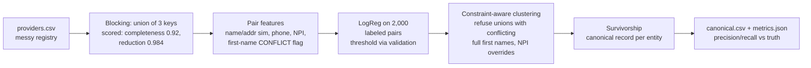

# provider-record-linker

**Fuzzy record linkage for provider master data that reports its own error rates: 0.978 pairwise precision and 0.862 recall against labeled duplicate groups, blocking scored by pair-completeness (0.92, the honest recall ceiling), and a constraint-aware clustering step that survived the chain-merge trap all edge-level guards failed, measured 0/20 wrongly merged practices.**


## What this solves

- Provider registries accumulate duplicates (name variants, moves, phone-format chaos, missing identifiers) that double-count in networks, misroute claims, and corrupt every provider-level report; the linker resolves 7,504 records into 4,386 entities with survivorship-selected canonical rows.
- Every dedup tool demos well and fails silently in two specific places; both are first-class, measured concerns here: blocking loses pairs before matching begins (pair-completeness 0.92, printed on every run), and transitive chain merges weld distinct providers through shared-practice bridge records (0/20 seeded traps merged, after two failed guard designs whose failure numbers are in the ADR).
- A national-identifier match overrides a name conflict (legal name changes are real), and that judgment call is a tested rule, not an accident.

## The problem

Two records for Dr. James Smith, one as "J. Smith MD" at the old address, one with a typo in the NPI. A registry where 46% of records are duplicates of some other record is not unusual, and every analysis grouping by provider silently double-counts until someone links them. The linkage itself is a chain of decisions that each cap final quality: which pairs to even compare (blocking), how to score a pair (features + classifier), when a score means "same" (threshold), and how pairs become entities (clustering). This repo measures every link in that chain against labeled ground truth.

Blocking unions three keys (normalized postcode, surname+city, phone last-4) and reports pair-completeness and reduction ratio per run: 0.92 of true pairs survive into candidates while avoiding 98.4% of the n² comparisons, and that 0.92 is the recall ceiling, stated up front (moved providers sharing no key are unreachable, and the fix is a new key, not a smarter model). Pair features are deliberately stdlib-simple (token-sorted name similarity, normalized address similarity, phone/NPI equality, a first-name conflict flag); a logistic regression trained on a 2,000-pair labeled budget picks its threshold on validation. Clustering is where the interesting engineering lives: agglomeration in descending score order that refuses any union placing two conflicting full first names into one entity unless a matching NPI proves identity.

The generator seeds the failure modes on purpose: 15% moved providers (recall stress), and shared-practice traps (two distinct doctors, same surname, same address, same practice phone, plus an initials-only bridge record that legitimately resembles both). Ground truth ships separately; the pipeline never reads it except for the labeled training budget and evaluation.

## Architecture



## Tech stack

| Technology | Role in this project | Why chosen here |
|---|---|---|
| Pandas + stdlib difflib | Blocking and features | SequenceMatcher on normalized forms is transparent and dependency-light; the discipline is in the measurement, not the string metric |
| scikit-learn LogisticRegression | Match scoring | Budgeted supervision with inspectable weights; threshold chosen on validation, printed with results |
| Union-find with constraints | Entity clustering | The chain-merge fix demands cluster-level invariants (ADR-001); processing edges by descending score makes bridge assignment deterministic |
| pytest | Correctness | The bridge-weld test constructs James/John/J. Smith at one practice with ALL edges accepted and asserts the doctors stay apart |
| GitHub Actions | CI | Tests plus the seeded demo with trap-merge count asserted zero |

## Quickstart

Prerequisites: Python 3.11+.

```bash
git clone https://github.com/MohansaiSundarasetty/provider-record-linker.git
cd provider-record-linker
python -m venv .venv && source .venv/bin/activate
pip install -e ".[dev]"

python -m linker.generator --entities 4000 --out data
linker run --data data --budget 2000 --out out
# 7504 records -> 4386 entities
# precision 0.978, recall 0.862, blocking completeness 0.917
# trap merges: 0/20
python -m linker.evaluate --data data     # full metrics JSON

pytest --cov=linker   # 9 tests
```

## Performance under load

Methodology: `benchmark/scale.py` generates registries at three sizes and times the full pipeline (blocking, features, training, clustering, survivorship, evaluation). Raw output in `benchmark/results/scale.json`.

| Entities | Records | Wall-clock | Precision | Recall | Trap merges |
|---|---|---|---|---|---|
| 2,000 | 3,745 | 7.7 s | 0.991 | 0.862 | 0/? seeded |
| 5,000 | 9,469 | 45.5 s | 0.957 | 0.814 | 1 |
| 10,000 | 18,852 | 64.9 s | 0.952 | 0.820 | 0 |

Runtime is dominated by pair feature computation (SequenceMatcher per candidate pair); reduction ratio holds at 0.984-0.995, which is what keeps 18.8k records at 65 seconds instead of 177M comparisons. The single trap merge at 5k (one practice out of ~25 seeded) traces to a bridge whose variant record ALSO abbreviated to initials, leaving no full-name conflict to refuse: a measured, explainable residual, not a mystery.

## Architecture decisions

- [ADR-001](docs/adr/ADR-001-cluster-level-constraints.md): chain-merge protection must live at the cluster level; both edge-level designs measured and failed (one uselessly, one catastrophically).
- [ADR-002](docs/adr/ADR-002-blocking-measured.md): blocking is measured, never assumed; pair-completeness is the recall ceiling and it prints on every run.

## Intentionally out of scope

- **Phonetic and embedding similarity** (Soundex, vector matching). The measured baseline comes first; these are candidates when the per-block miss analysis shows string similarity as the binding constraint, not before.
- **Incremental linkage** (new records against an existing linked registry). The batch pipeline establishes the invariants; incremental mode reuses the same constraint clustering with frozen clusters. Trigger: a consumer with daily deltas.
- **Human review queue.** accepted_pairs.csv with scores IS the review artifact; a UI belongs to the MDM platform that adopts this.

## Security and compliance

- All data is synthetic; real provider registries are commercially sensitive and occasionally PHI-adjacent (sole practitioners). Nothing here has touched real data.
- The linker runs local, no network. Canonical outputs inherit the registry's access controls; survivorship keeps identifiers (NPI) that deserve the same care as the inputs.

## Failure modes

| Failure | Detection | Behavior | Recovery |
|---|---|---|---|
| True pair split across all blocking keys | Pair-completeness metric | Unrecoverable downstream, VISIBLE upstream (0.92 printed) | Add a key; per-key contribution stats guide it |
| Distinct providers at one practice | Seeded traps + conflict constraint | Union refused; 0/20 merged | The residual case (all-initials bridges) is documented with its number |
| Legal name change (conflict is wrong) | NPI equality | NPI overrides the name constraint (tested) | None needed |
| Dense-city postcode blocks explode | 200-record block guard | Block skipped for that key; other keys still cover | Tighten the key (postcode+surname initial) |
| Threshold drift as data changes | Threshold printed with held-out F1 per run | Retraining is one command on a fresh labeled sample | Re-run with a new budget |

## Hardest problem solved

The chain-merge investigation took three designs, and the middle one is the valuable scar: it made things WORSE while looking more principled.

The seeded trap is a group practice: two distinct doctors, same surname, same address, same practice phone line, plus an initials-only record ("J. Smith") that genuinely resembles both. Design one, a name-similarity floor on accepted edges, measured useless: 1 of 15 traps merged with the guard on or off, because the classifier already rejected the direct James-vs-John pairs; the floor was solving a problem the model did not have. Design two looked smarter: drop any accepted edge whose full first names conflict. Result: 15 of 15 traps merged. The bridge record is the reason: no direct James-John edge is needed when "J. Smith" legitimately links to both, every individual edge looks fine, and transitivity does the welding. Edge-level rules cannot express an entity-level invariant.

Design three moved the constraint to where the invariant lives: agglomerate accepted edges in descending score order, and refuse any union that would place two conflicting full first names inside one entity, unless a matching NPI proves identity (name changes are real, and that override has its own test). Zero of twenty traps merged on the demo, with the genuinely ambiguous bridge landing on its best-scoring side, which is honest uncertainty rather than error. The transferable lesson: when the invariant is about the ENTITY, no amount of edge filtering enforces it, and the measured 1/15, 15/15, 0/20 progression (commit `git log --grep=cluster`) is the whole argument compressed into three numbers.

## Future work

- Per-block miss analysis: which true pairs die in blocking, categorized, to drive the next key.
- Incremental linkage mode with frozen clusters.
- Pair-review export ranked by decision uncertainty (|score - threshold|) for a labeling-efficient second budget.
- Phonetic keys measured against the same harness.
- Survivorship policies as configuration (freshest vs most complete vs source-priority).
