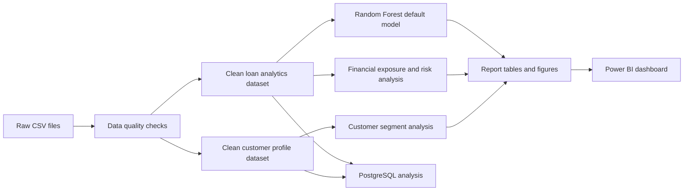

# Banking Customer Portfolio & Default Risk Analytics

An end-to-end banking analytics project using Python, PostgreSQL, Power BI and Random Forest modelling.

This project studies customer profiles, financial position, loan exposure, repayment behaviour and default risk for a synthetic banking portfolio of 15,000 customers. The final output includes cleaned datasets, notebook analysis, SQL validation queries, report tables, figures, a Power BI dashboard and a Random Forest default-risk model.

## Business Problem

Banks need to understand customer financial strength and loan risk before making lending and portfolio-management decisions. A customer may have high income, but still carry high debt, weak repayment behaviour or high loan-to-value exposure.

This project answers:

- Which customer segments hold the highest deposit value?
- Where is loan exposure concentrated?
- Which loan products have higher default risk?
- Which risk indicators are connected with repayment problems?
- Which active loans should be reviewed first by the bank?

The project does not replace credit approval. It supports descriptive portfolio analysis and risk review.

## Dataset Overview

| Item | Detail |
|---|---:|
| Customer profiles | 15,000 |
| Loan records | 11,911 |
| Customers with loans | 10,279 |
| Customers without loans | 4,721 |
| Default loans | 1,478 |
| Not default loans | 10,433 |
| Loan default rate | 12.41% |
| Customer-level default rate | 13.97% |
| Total loan exposure | INR 2460.72 crore |
| Expected loss | INR 199.17 crore |

Raw files:

| File | Purpose |
|---|---|
| `data/raw/customers.csv` | Customer profile fields such as age, gender, occupation, nationality and relationship type. |
| `data/raw/financial_profile.csv` | Income, deposits, card balances, debt payments and financial strength indicators. |
| `data/raw/loans.csv` | Loan amount, loan type, term, rate, collateral and purpose. |
| `data/raw/loan_risk.csv` | Credit score, DTI, LTV, missed payments, days past due, repayment status and `default_flag`. |

Processed files:

| File | Purpose |
|---|---|
| `data/processed/banking_customer_profiles_clean.csv` | One clean row per customer. Used for customer segmentation. |
| `data/processed/banking_customer_loan_analytics_clean.csv` | One clean row per loan with joined customer, financial and risk fields. Used for lending-risk analysis and modelling. |

## Project Workflow



## Repository Structure

```text
banking-customer-analytics/
|-- data/
|   |-- raw/
|   |   |-- customers.csv
|   |   |-- financial_profile.csv
|   |   |-- loans.csv
|   |   `-- loan_risk.csv
|   `-- processed/
|       |-- banking_customer_profiles_clean.csv
|       `-- banking_customer_loan_analytics_clean.csv
|-- notebooks/
|   |-- 01_data_quality_and_preparation.ipynb
|   |-- 02_customer_and_segment_eda.ipynb
|   |-- 03_financial_exposure_and_risk_eda.ipynb
|   `-- 04_default_prediction_model.ipynb
|-- reports/
|   |-- README.md
|   |-- figures/
|   `-- tables/
|-- sql/
|   |-- 01_schema_and_validation.sql
|   |-- 02_customer_segment_analysis.sql
|   `-- 03_financial_and_risk_analysis.sql
|-- dashboard/
|-- requirements.txt
`-- README.md
```

## How To Read This Project

Read the notebooks in this order:

1. `01_data_quality_and_preparation.ipynb`
2. `02_customer_and_segment_eda.ipynb`
3. `03_financial_exposure_and_risk_eda.ipynb`
4. `04_default_prediction_model.ipynb`

Then open:

1. `reports/README.md` for report outputs
2. `sql/` for PostgreSQL validation and analysis
3. `dashboard/` for the Power BI dashboard files

## Notebook 1: Data Quality And Preparation

This notebook prepares the data for the full project.

What it does:

- Loads four raw CSV files.
- Checks row counts, columns, missing values and duplicate keys.
- Cleans inconsistent category text.
- Validates customer-to-financial and loan-to-risk relationships.
- Creates calculated fields such as total deposits, deposit-to-income ratio, DTI bands, LTV bands, credit score bands and recent delinquency flags.
- Saves the two final processed datasets.

Main findings:

| Check | Result |
|---|---:|
| Customer base prepared | 15,000 customers |
| Loan portfolio prepared | 11,911 loan records |
| Customers with loans | 10,279 customers |
| Overall default rate | 12.41% |
| Total loan exposure | INR 2460.72 crore |
| Total expected loss | INR 199.17 crore |
| Highest DTI band default rate | 21.78% |
| High risk band default rate | 53.82% |

Important output files:

- `data/processed/banking_customer_profiles_clean.csv`
- `data/processed/banking_customer_loan_analytics_clean.csv`
- `reports/tables/data_quality_summary.csv`
- `reports/tables/data_dictionary.csv`
- `reports/figures/data_quality/outlier_boxplots.png`

## Notebook 2: Customer And Segment Analysis

This notebook explains who the bank customers are before studying loan risk.

What it analyzes:

- Age groups
- Gender distribution
- Occupations
- Employment status
- Banking relationship type
- Loyalty tiers
- Income bands
- Deposit strength
- Credit utilization
- Advisor-level portfolio size

Main findings:

| Finding | Result |
|---|---|
| Total customers | 15,000 |
| Median age | 47 |
| Median annual income | INR 874,387 |
| Median total deposits | INR 2,344,104 |
| Average customer tenure | 14.30 years |
| Largest age group | 46-55 with 4,351 customers |
| Largest relationship segment | Retail with 7,821 customers, 52.14% |
| Highest median deposit segment | Private Bank with INR 2,957,191 median deposits |
| Highest deposit loyalty tier | Platinum with INR 4,902,204 median deposits |
| Most common credit utilization band | Low with 10,257 customers |
| Highest value common occupation | Shop Owner with INR 2,512,022 median deposits |

Why this matters:

- Retail is the largest customer segment, so it drives customer volume.
- Private Bank customers have stronger deposit balances, so they matter for relationship value.
- Low credit utilization is common, which means many customers are not overusing credit cards.
- Loyalty tier and relationship type help compare customer value before looking at loan risk.

Important output files:

- `reports/tables/customer_kpis.csv`
- `reports/tables/customer_segment_insights.csv`
- `reports/tables/banking_relationship_summary.csv`
- `reports/tables/loyalty_summary.csv`
- `reports/figures/customer_segments/customer_segment_donut_charts.png`
- `reports/figures/customer_segments/customer_value_boxplots.png`
- `reports/figures/customer_segments/customer_segment_heatmaps.png`

## Notebook 3: Financial Exposure And Risk Analysis

This notebook explains the bank's lending exposure and repayment-risk profile.

What it analyzes:

- Loan exposure by loan type
- Repayment status distribution
- Default rate by loan product
- Default rate by risk band
- Default rate by DTI, credit score and LTV bands
- Recent delinquency behaviour
- Expected loss by product and segment
- Correlation between risk indicators

Main lending findings:

| Finding | Result |
|---|---|
| Loan records | 11,911 |
| Customers with loans | 10,279 |
| Total loan exposure | INR 2460.72 crore |
| Median loan amount | INR 1,242,368 |
| Default rate | 12.41% |
| Expected loss | INR 199.17 crore |
| Largest exposure product | Home Loan with INR 1710.92 crore exposure |
| Highest default-rate product | Business Loan with 30.79% default rate |
| Highest expected-loss product | Home Loan with INR 106.05 crore expected loss |

Loan product summary:

| Loan type | Loans | Exposure | Default rate | Expected loss |
|---|---:|---:|---:|---:|
| Home Loan | 4,565 | INR 1710.92 crore | 13.21% | INR 106.05 crore |
| Business Loan | 1,929 | INR 493.90 crore | 30.79% | INR 84.94 crore |
| Auto Loan | 2,169 | INR 122.54 crore | 5.72% | INR 3.11 crore |
| Personal Loan | 2,527 | INR 100.69 crore | 5.07% | INR 3.97 crore |
| Education Loan | 721 | INR 32.66 crore | 4.02% | INR 1.10 crore |

Risk findings:

| Risk indicator | Result |
|---|---:|
| High-risk band default rate | 53.82% |
| Medium-risk band default rate | 7.53% |
| Low-risk band default rate | 0.02% |
| DTI above 60% default rate | 21.78% |
| Recent delinquency default rate | 23.31% |
| Commercial relationship default rate | 22.80% |

Why this matters:

- Home Loans hold the largest exposure, so even a moderate default rate creates large expected loss.
- Business Loans have the highest default rate, so they need stricter monitoring.
- DTI, missed payments and days past due are strong warning signals.
- Risk band separates customers clearly: high-risk loans default much more often than low-risk loans.

Important output files:

- `reports/tables/portfolio_kpis_readable.csv`
- `reports/tables/lending_risk_insights.csv`
- `reports/tables/loan_type_summary.csv`
- `reports/tables/risk_band_summary.csv`
- `reports/tables/default_by_dti_band.csv`
- `reports/tables/risk_field_correlation_matrix.csv`
- `reports/figures/financial_exposure/loan_type_exposure_and_default_rate.png`
- `reports/figures/financial_exposure/risk_band_default_and_expected_loss.png`
- `reports/figures/financial_exposure/loan_risk_boxplots.png`
- `reports/figures/financial_exposure/risk_field_correlation_heatmap.png`

## Notebook 4: Random Forest Default Prediction Model

This notebook builds a Random Forest classification model to predict `default_flag`.

Target meaning:

| Value | Meaning |
|---:|---|
| `0` | Not default: the loan is not marked as defaulted in the dataset. |
| `1` | Default: the loan is marked as defaulted because repayment behaviour is bad enough to be treated as a failure to repay. |

Two Random Forest feature sets are used:

| Feature set | Purpose |
|---|---|
| Approval-style | Uses profile, income, loan and financial fields that are closer to loan approval information. |
| Monitoring | Adds repayment-warning fields such as missed payments, days past due and risk band. |

Model performance:

| Feature set | Accuracy | Precision | Recall | F1-score | ROC-AUC |
|---|---:|---:|---:|---:|---:|
| Monitoring Random Forest | 0.9510 | 0.7258 | 0.9730 | 0.8314 | 0.9873 |
| Approval-style Random Forest | 0.7864 | 0.3061 | 0.5676 | 0.3977 | 0.7731 |

The monitoring model performs better because it uses active repayment-warning signals. It should be explained as a loan-monitoring model. The approval-style model is weaker because it does not use direct delinquency signals.

Most important features in the monitoring model:

| Feature | Importance |
|---|---:|
| `days_past_due` | 38.50% |
| `risk_band` | 24.50% |
| `missed_payments_12m` | 14.49% |
| `debt_to_income_ratio` | 3.85% |
| `credit_score` | 3.31% |

Important output files:

- `reports/tables/model_default_target_summary.csv`
- `reports/tables/model_performance_metrics.csv`
- `reports/tables/random_forest_feature_importance.csv`
- `reports/tables/high_risk_loan_predictions.csv`
- `reports/tables/model_probability_group_summary.csv`
- `reports/figures/modeling/best_model_confusion_matrix.png`
- `reports/figures/modeling/random_forest_feature_importance.png`
- `reports/figures/modeling/roc_curves.png`

## PostgreSQL Analysis

The SQL files reproduce the same project logic in PostgreSQL.

| SQL file | Purpose |
|---|---|
| `sql/01_schema_and_validation.sql` | Checks imported tables, row counts, duplicates, missing values, invalid ranges and customer-loan joins. |
| `sql/02_customer_segment_analysis.sql` | Recreates customer segment analysis by age, gender, relationship, loyalty, income and advisor. |
| `sql/03_financial_and_risk_analysis.sql` | Recreates loan exposure, repayment, risk-band, DTI, LTV, default and expected-loss analysis. |

Expected imported PostgreSQL tables:

- `public.banking_customer_profiles_clean`
- `public.banking_customer_loan_analytics_clean`

Example run:

```bash
psql -d banking_project -f sql/01_schema_and_validation.sql
psql -d banking_project -f sql/02_customer_segment_analysis.sql
psql -d banking_project -f sql/03_financial_and_risk_analysis.sql
```

## Reports

The `reports/` folder contains reusable CSV summaries and chart images generated from the notebooks.

Current report outputs:

- 51 CSV tables
- 35 figure files
- `reports/README.md` explains which report files to read first

## Dashboard

The Power BI dashboard is included under `dashboard/` with PBIX, PBIP and screenshots. It is meant to present the customer portfolio, loan exposure and risk findings visually.

## Setup

Install requirements:

```bash
python -m venv .venv
python -m pip install -r requirements.txt
```

Run notebooks in order:

```text
01_data_quality_and_preparation.ipynb
02_customer_and_segment_eda.ipynb
03_financial_exposure_and_risk_eda.ipynb
04_default_prediction_model.ipynb
```

## Limitations

- The dataset is synthetic and created for learning/project demonstration.
- The model supports risk review; it should not replace human credit decisions.
- The monitoring model uses repayment-warning fields, so it should not be treated as a pure loan-approval model.
- There is no transaction-level time series.
- Real bank deployment would require governance, fairness checks, model monitoring and validation on real historical data.
