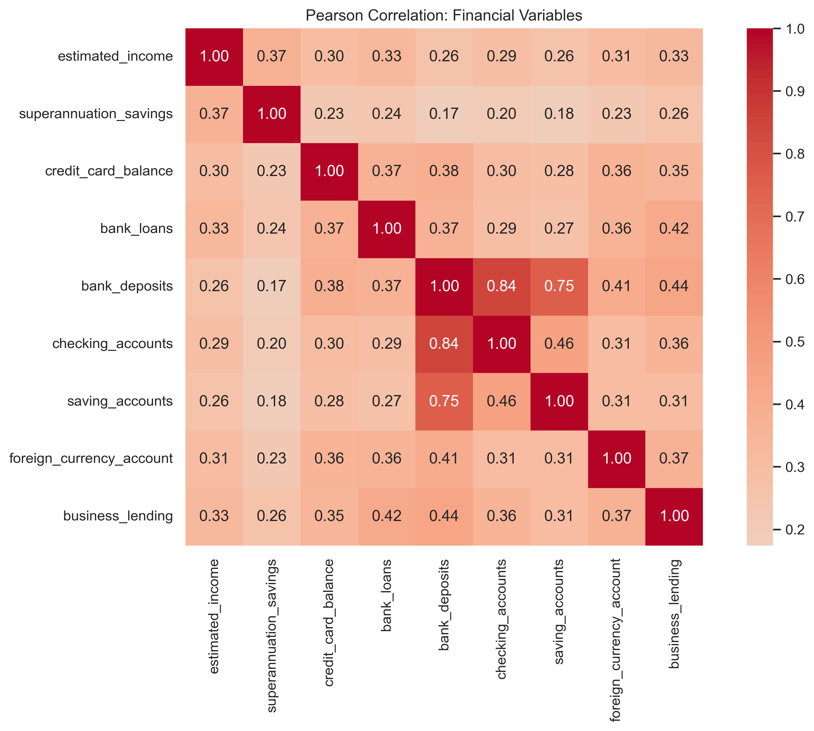
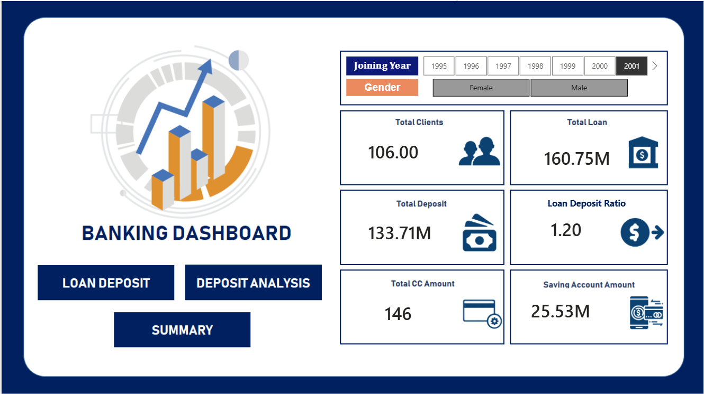
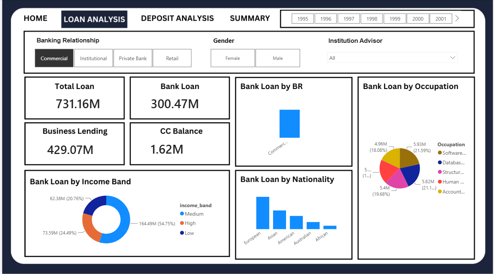
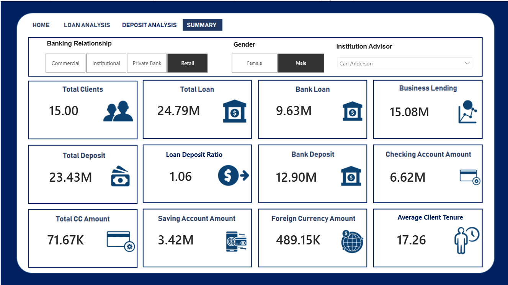

# Banking Customer Portfolio & Exposure Analytics

An end-to-end descriptive analysis of banking customers, portfolio balances and recorded risk weighting using Python and PostgreSQL.

## Project overview

This project analyses 3,000 customer records across demographics, customer segments, product holdings, deposits and lending balances. It follows a complete workflow from a raw CSV to Python EDA, PostgreSQL analysis and reusable report outputs.

## Business problem

Banking data combines customer details, internal category codes, product holdings and financial balances. It must be checked and prepared before the portfolio can be described reliably.

The project answers three questions:

1. Is the dataset suitable for analysis?
2. What customer and segment patterns are visible?
3. How are financial balances, lending exposure and recorded risk weights distributed?

## Objectives

- Prepare and validate an analysis-ready dataset while preserving the raw file.
- Analyse customer profiles, segments and joining cohorts.
- Compare financial balances, lending exposure and recorded risk weighting.
- Reproduce the main checks and analysis in PostgreSQL.
- Save useful figures and summary tables.

## Dataset overview

| Item | Detail |
|---|---|
| Raw file | [`data/raw/Banking.csv`](data/raw/Banking.csv) |
| Processed file | [`data/processed/banking_customers_clean.csv`](data/processed/banking_customers_clean.csv) |
| Raw shape | 3,000 rows × 25 columns |
| Processed shape | 3,000 rows × 30 columns |
| Joining-date range | 3 January 1995 to 31 December 2021 |
| Identifier check | 2,940 unique IDs; 60 duplicate occurrences after the first |
| Added fields | `join_year`, `join_month`, `join_month_name`, `join_decade`, `income_band` |

The fields cover demographics, income, product holdings, account balances, business lending and risk weighting.

## Project workflow

`Raw CSV → Python EDA → PostgreSQL → Power BI dashboard`

## Repository structure

```text
banking-customer-analytics/
├── data/
│   ├── raw/Banking.csv
│   └── processed/banking_customers_clean.csv
├── notebooks/
│   ├── 01_data_quality_and_preparation.ipynb
│   ├── 02_customer_and_segment_eda.ipynb
│   └── 03_financial_exposure_and_risk_eda.ipynb
├── sql/
│   ├── 01_schema_and_validation.sql
│   ├── 02_customer_segment_analysis.sql
│   └── 03_financial_and_risk_analysis.sql
├── reports/
│   ├── figures/
│   └── tables/
├── dashboard/
│   ├── banking analysis_completed.pbix
│   ├── pbip/
│   │   ├── banking analysis_completed.pbip
│   │   ├── banking analysis_completed.Report/
│   │   └── banking analysis_completed.SemanticModel/
│   └── screenshots/
├── requirements.txt
└── README.md
```

## Tools and technologies

| Area | Tools |
|---|---|
| Data preparation and EDA | Python, pandas, NumPy, SciPy |
| Visualisation | Matplotlib, Seaborn |
| Notebook workflow | Jupyter, nbformat, nbclient |
| Database analysis | PostgreSQL, SQLAlchemy, psycopg |
| Dashboard and reporting | Power BI Desktop, PBIX, PBIP |

## EDA methodology

| Notebook | Work completed |
|---|---|
| [EDA 1 — Data quality and preparation](notebooks/01_data_quality_and_preparation.ipynb) | Standardised columns, checked data quality, prepared dates and income bands, flagged IQR outliers and exported the processed dataset. |
| [EDA 2 — Customer and segment analysis](notebooks/02_customer_and_segment_eda.ipynb) | Analysed demographics, income, loyalty, fees, BR groups, product holdings and joining cohorts using counts, medians and normalised comparisons. |
| [EDA 3 — Financial and recorded risk-weighting analysis](notebooks/03_financial_exposure_and_risk_eda.ipynb) | Examined financial distributions, outliers, correlations, exposure and the recorded ordinal risk-weighting field. |

## PostgreSQL analysis

The SQL analysis uses the confirmed table `public.banking_customers`.

| File | Purpose |
|---|---|
| [Schema and data validation](sql/01_schema_and_validation.sql) | Checks schema, row counts, repeated IDs, missing values, dates, ranges and categories. |
| [Customer segment analysis](sql/02_customer_segment_analysis.sql) | Analyses demographics, segments, product holdings, cohorts and banking contacts. |
| [Financial and risk analysis](sql/03_financial_and_risk_analysis.sql) | Analyses balances, ratios, exposure, concentration and recorded risk weighting. |

The scripts are read-only and use PostgreSQL CTEs, medians, filtered aggregates and window functions.

## Key computed insights

1. The 3,000 records have no missing cells or exact duplicate rows, but contain 2,940 unique client IDs. Segment results are therefore record-based.
2. Median age is 51, and the 65-and-above group is the largest with 915 records (30.50%).
3. Mid income is the largest band with 1,517 records (50.57%); these income bands are specific to this project.
4. European is the largest nationality with 1,309 records (43.63%), while Jade is the largest loyalty group with 1,331 records (44.37%).
5. Median deposits increase from 336,806.30 in Low income to 735,655.26 in High income. This is an association, not a causal result.
6. Deposits and checking accounts have the strongest financial association (Pearson 0.844; Spearman 0.880), although these account fields may overlap.
7. Saving accounts has the highest skewness (2.193) and 155 IQR-flagged records (5.17%). These high values were retained.
8. Risk weights 1 and 2 contain 68.60% of records. The field is descriptive, and its risk direction is not confirmed.

## Visualisations

The EDA figures are available under [`reports/figures/`](reports/figures/).



## Dashboard status

**Completed.** The Power BI dashboard contains Home, Loan Analysis, Deposit Analysis and Summary pages. Both the [PBIX file](dashboard/banking%20analysis_completed.pbix) and the source-controlled [PBIP project](dashboard/pbip/banking%20analysis_completed.pbip) are included.

### Home



### Loan analysis



### Deposit analysis


### Summary



## Setup and execution

### 1. Install requirements

```bash
python -m venv .venv
python -m pip install -r requirements.txt
```

Activate the environment, then run `jupyter lab`.

### 2. Run notebooks in order

1. `notebooks/01_data_quality_and_preparation.ipynb`
2. `notebooks/02_customer_and_segment_eda.ipynb`
3. `notebooks/03_financial_exposure_and_risk_eda.ipynb`

EDA 1 creates the processed CSV used by EDA 2 and EDA 3.

### 3. Create the PostgreSQL database

```bash
createdb banking_project
```

### 4. Load the processed dataset

Set `DATABASE_URL` securely without saving credentials in the repository. Run this from a Python session at the project root:

```python
import os
import pandas as pd
from sqlalchemy import create_engine

customers = pd.read_csv("data/processed/banking_customers_clean.csv")
engine = create_engine(os.environ["DATABASE_URL"])

customers.to_sql(
    name="banking_customers",
    con=engine,
    schema="public",
    if_exists="replace",
    index=False,
)
```

### 5. Run SQL files in order

```bash
psql -d banking_project -f sql/01_schema_and_validation.sql
psql -d banking_project -f sql/02_customer_segment_analysis.sql
psql -d banking_project -f sql/03_financial_and_risk_analysis.sql
```

## Limitations

- No loan-default outcome is available.
- No repayment history is provided.
- No credit score or delinquency data is available.
- There is no transaction-level time series.
- Risk weighting is descriptive and does not represent confirmed default probability.
- The analysis is descriptive, not predictive.
- Currency, valuation date and some internal category mappings are not supplied.
- Repeated client IDs cannot be resolved without a verified business key.
- Deposit, checking and saving fields may overlap.

## Future improvements

- Extend the Power BI dashboard if additional business requirements are provided.
- Confirm internal code mappings, currency and valuation date.
- Resolve repeated IDs using a trusted source-system key.
- Add transaction-level analysis if dated records become available.
- Consider predictive modelling only if a valid outcome is provided.


